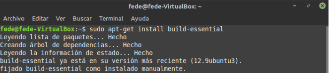

<span style="color: red;"> Falta transcribir el informe en este archivo Mardkdown (.md).
El informe completo se encuentra en el siguiente link: [TP#4 - Módulos de Kernel](https://github.com/AbelCorvalan0/SistComp/blob/master/TP4/TP4%20-%20M%C3%B3dulo%20de%20Kernel.pdf)</span>

# TP #4 Módulos de kernel - Sistemas de Computación

## Introducción

En los kernels de Linux, los módulos son piezas de código que se pueden cargar dinámicamente en el núcleo del sistema operativo. Estos módulos amplían la funcionalidad del kernel sin necesidad de recompilarlo o reiniciar el sistema.

Estos permiten añadir nuevas características, controladores de dispositivos o sistemas de archivos al kernel en tiempo de ejecución sin modificar el código fuente del kernel base. Se cargan en la memoria solo cuando son necesarios, lo que permite un uso más eficiente de los recursos del sistema. Los usuarios pueden cargar y descargar módulos según sea necesario, lo que permite una configuración más flexible del sistema. Al separar el código en módulos, se facilita el mantenimiento y la actualización del kernel, ya que no es necesario recompilar todo el kernel para hacer cambios en un módulo específico. Además, los módulos facilitan la depuración y el desarrollo de nuevas características del kernel, ya que los cambios pueden comprobarse de forma incremental sin afectar al kernel en funcionamiento.

## Primeras tareas

El primer comando permite instalar un conjunto básico de herramientas de compilación llamado build-essential, que incluye compiladores y otros programas necesarios para compilar software desde el código fuente.



El segundo comando permite instalar el código fuente del kernel de Linux para permitirnos compilar el kernel desde cero, modificar la configuración del kernel o compilar módulos del kernel que no están incluidos en la distribución estándar del mismo. 


#### Instalación de Headers

Para construir software que interactúe con el kernel, como módulos del kernel o programas de usuario que hagan uso de las llamadas al sistema del kernel, es necesario tener instalados los "headers" correspondientes al kernel en uso. Estos "headers" proporcionan las definiciones necesarias para que el compilador pueda operar correctamente el software y establecer la comunicación adecuada con el kernel.


## Mi primer módulo

Generamos el siguiente archivo .c que servirá como primer módulo.

```c 

/* 
* hello-1.c - The simplest kernel module. 
*/ 
#include <linux/module.h> /* Needed by all modules */ 
#include <linux/printk.h> /* Needed for pr_info() */ 
 
int init_module(void) 
{ 
    pr_info("Hello world 1.\n"); 
 
    /* A non 0 return means init_module failed; module can't be loaded. */ 
    return 0; 
} 
 
void cleanup_module(void) 
{ 
    pr_info("Goodbye world 1.\n"); 
} 
 
20MODULE_LICENSE("GPL");
```
También necesitaremos el makefile correspondiente para compilar nuestro módulo.

```sh
obj-m += hello-1.o 
 
PWD := $(CURDIR) 
 
all: 
    make -C /lib/modules/$(shell uname -r)/build M=$(PWD) modules 
 
clean: 
    make -C /lib/modules/$(shell uname -r)/build M=$(PWD) clean

```
Estos archivos deben ejecutarse desde el directorio **/Desktop/**.

#### Generación, añadido del módulo de Kernel

Generamos los archivos mediante el Makefile anteriormente mostrado con el siguiente comando:


Se consigue la información del archivo mediante el siguiente comando:

```sh
modinfo Módulo.ko
```

Se comparan las características para las dos computadores de los integrantes del grupo.


Los archivos generados con el archivo “Makefile” los cuales tienen extensión .ko (kernel object) son módulos del kernel. Se observa que la única diferencia entre los mismos es el campo denominado “vermagic”. Este campo muestra el nombre de la versión exacta del kernel con la que el módulo fué compilado. Para el primer caso tenemos la versión 5.15.0-106-generic SMP mod_unload modversions, mientras que para el segundo se tiene la versión 6.5.0-35-generic SMP preempt mod_unload modversions. Ambas versiones de kernel soportan SMP (Symmetric Multiprocessing). Para el caso 2 tenemos que esta versión es preemptible, lo que significa que el kernel puede suspender la ejecución de una tarea en modo kernel (mientras se está ejecutando código del mismo) para permitir que otra tarea con mayor prioridad se ejecute. Se mejora la capacidad de respuesta y se reduce la latencia. Estas características analizadas (soporte SMP y preempt) son dos características pueden afectar la compatibilidad a la hora de ejecutar un módulo.

Con el comando **“insmode”** lo agregamos al kernel. Si intentamos agregarlo de nuevo, la terminal nos indica que ya existe el archivo y mediante **“rmmod”** puede eliminarse del kernel.


Por último podemos verificar la correcta instalación mediante:

```sh
lsmod | grep Módulo
```


## El sistema de ficheros /proc

En Linux, hay un mecanismo adicional para que el kernel y los módulos del kernel envíen información a los procesos: el sistema de archivos /proc el cual fue originalmente diseñado para permitir un fácil acceso a la información sobre los procesos (De allí su nombre).

Su funcionamiento es muy similar al utilizado con los controladores de dispositivos: se crea una estructura con toda la información necesaria para el archivo /proc, incluidos los punteros a cualquier función de controlador (en nuestro caso, solo uno, el que se llama cuando alguien intenta leer desde el archivo /proc). Luego, init_module registra la estructura con el kernel y cleanup_module la elimina.

A diferencia de un sistema de archivos convencional que almacena archivos en el disco, /proc almacena información en la memoria RAM y se genera dinámicamente por el kernel. Algunas de los archivos de /proc más utilizados son: 

- **cpuinfo y meminfo:** El primero proporciona información detallada sobre el procesador tales como fabricante, modelo, velocidad y características. El segundo muestra información de la memoria del sistema, incluyendo la memoria física total, libre y utilizada.


- **loadavg:** Muestra el promedio de carga del sistema en diferentes intervalos de tiempo, lo que nos permite monitorear la carga del sistema y la utilización de recursos.


- **partitions:** Proporciona una lista las particiones de disco en el sistema, incluyendo información como el tamaño de las particiones y el tipo de sistema de archivos.

- **version:** Muestra información sobre la versión del kernel de Linux que está siendo ejecutada en el sistema, así como también información adicional sobre la configuración del kernel.


- **net:** Proporciona información sobre el estado de las conexiones de red del sistema. En particular, el archivo /proc/net/tcp nos muestra información detallada sobre las conexiones TCP activas, como las direcciones IP y puertos locales y remotos, el estado de la conexión y el número de identificación del proceso (PID) asociado. 