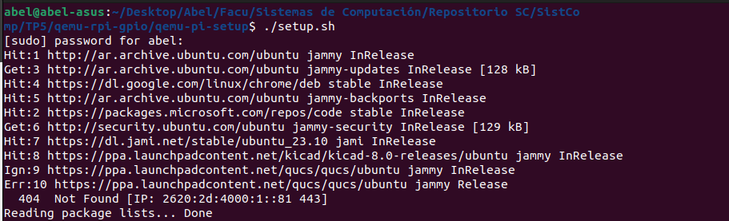
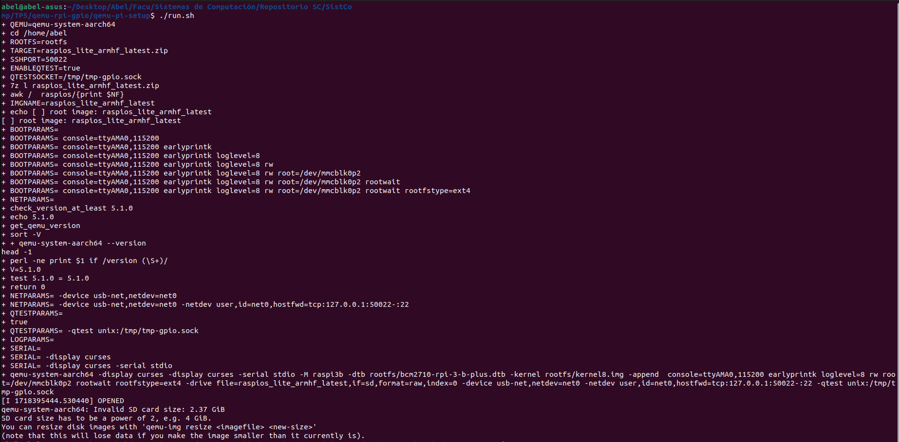
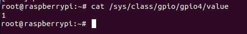

Este archivo se encuentra en edición. Se adjunta la información de las  primeras actividades (implementación de Driver1, Driver2, Driver3, Driver4) en el siguiente link: [TP#5 - Drivers](https://github.com/AbelCorvalan0/SistComp/blob/master/TP5/TP%20%235%20-%20Drivers.pdf)


# TP #5 Drivers - Sistemas de Computación

## Integrantes

- Corvalán, Abel Nicolás - Ing. Electrónica
- Soria, Federico - Ing. en Computación

## Introducción

Un `driver` es aquel que conduce, administra, controla, dirige, monitorea la entidad bajo su mando. Un `bus driver` hace eso con un "bus". De manera similar, un `device driver` hace lo mismo con un dispositivo. Un dispositivo puede ser cualquier periférico conectado a una computadora, por ejemplo, un mouse, un teclado, una pantalla/monitor, un disco duro, una cámara, un reloj, etc.

Un `driver` puede ser una persona o sistemas automáticos, posiblemente monitoreados por otra persona. Del mismo modo, el `device driver` podría ser una pieza de software u otro periférico/dispositivo, posiblemente controlado por un software. Sin embargo, si se trata de otro periférico/dispositivo, se denomina `device controller` en el lenguaje común. Por `driver` solo nos referimos a un `software driver`. Un `device controller` es un dispositivo en sí mismo y, por lo tanto, muchas veces también necesita un `driver`.

Los ejemplos generales de `device controller` incluyen controladores de disco duro, controladores de pantalla, controladores de audio para los dispositivos correspondientes. Ejemplos más técnicos serían los controladores para los protocolos de hardware, como un controlador IDE, un controlador PCI, un controlador USB, un controlador SPI, un controlador I2C, etc. 

## Marco teórico


### Driver: 

Se trata de un software que permite al sistema operativo interactuar con un periférico, creando una abstracción del hardware y proporcionando una interfaz -posiblemente estandarizada- para utilizarlo. Se puede graficar como un manual de instrucciones que indica cómo controlar y comunicarse con un dispositivo en particular. 

### CDD (Character Device Drivers) y CDF (Common Driver Framework):

Son un tipo de controlador de dispositivo en el sistema operativo Linux que manejan dispositivos que transmiten datos de manera secuencial, es decir, carácter por carácter.
A diferencia de los controladores de bloques, que manejan dispositivos que acceden a los datos en bloques (como discos duros). Los CDD leen y escriben datos carácter por carácter.

Estos drivers interactúan directamente con el kernel de Linux y pueden responder a interrupciones de hardware, administrar buffers de entrada y salida, y proporcionar interfaces de `ioctl` (entrada/salida controlada) para operaciones específicas del dispositivo.

### Drivers y buses:

En la siguiente figura se muestra la interacción de los drivers y buses:


Los `bus driver` proporcionan una interfaz específica de hardware para los correspondientes protocolos de hardware y son las capas de software (horizontales) más bajas de un sistema operativo. 

Sobre ellos se encuentran los `device driver`, que operan sobre los dispositivos subyacentes utilizando las interfaces de capa horizontal y, por lo tanto, son específicos del dispositivo.

La idea de escribir estos `drivers` es proporcionar una abstracción del hardware para las aplicaciones de usuario a través del sistema operativo. Ofrecer una interfaz común para el usuario que será específica para cada sistema operativo. 

Un `device driver` tiene dos partes: 

    1- Una específica del dispositivo 
    2- Otra específica del sistema operativo. 


## Pruebas de drivers

Se clona el repositorio `device-drivers`.

```sh
git clone https://gitlab.com/sistemas-de-computacion-unc/device-drivers.git
```


### Drv1.c

Como vimos en el trabajo práctico anterior, cualquier driver de Linux consta de un constructor y un destructor. 
Se llama al constructor de un módulo cada vez que insmod logra cargar el módulo en el núcleo y al destructor del módulo cada vez que rmmod logra descargar el módulo del núcleo. 
Estas funciones se implementan con las macros `module_init()` y `module_exit()` incluidas en el encabezado de `module.h`.

Primero buscamos los drivers en el primer enlace proporcionado y para comenzar se trabajará con el `drv1.c`, éste es un módulo simple ya que sólo imprime un mensaje al registro del kernel al ser cargado y otro mensaje al ser descargado sin otra operación adicional.


Se procede a compilar con `make all` y se verifica la información del  módulo mediante `modinfo`,de este modo se pueden ver atributos como la descripción, el autor o la versión.


Se inserta el módulo en el kernel mediante `sudo insmod`, con `dmeg` se verifica su correcta instalación y la impresión del mensaje. 


Como sucede con cualquier módulo, se remueve luego con `rmmod` por lo que se imprime el mensaje de la función `printk` del destructor `drv1_exit()`.


### Drv2.c

Del mismo modo que antes, compilamos el drv2 y se revisa su información. 


Se inserta el módulo y se verifica que se imprimió correctamente el mensaje del constructor:


A diferencia del Drv1, se observan 2 números en el registro, esto es debido a que este módulo registra dinámicamente un rango de números de dispositivo de carácter al cargarse y se libera ese rango al descargarse. ¿Pero qué son estos números?
Cada archivo de dispositivo tiene asociado un par de números conocidos como major y minor.

- `Major Number`: Identifica el controlador de dispositivo que maneja las operaciones para ese dispositivo, o dicho de otra manera, varios dispositivos del mismo tipo (controlados por el mismo controlador) compartirán el mismo número mayor.

- `Minor Number`: Este valor identifica el dispositivo específico gestionado por el controlador. por lo que diferentes dispositivos del mismo tipo tendrán diferentes números menores.

En la función de inicialización (drv2_init), se reserva un número mayor y tres números menores para el dispositivo, imprimiendo un mensaje de éxito y los números asignados en el registro del kernel. En la función de limpieza (drv2_exit), se libera el rango de números de dispositivo y se imprime un mensaje de despedida. 
El numero major es 237 y el minor, 0. Esto se puede revisar  también mediante  cat /proc/devices donde se observa que el driver se cargó en el major 237.


Al realizarse la asignación dinámica del número mayor (major number), no se puede anticipar cuál será el número asignado hasta que el módulo sea cargado por lo que dentro de la carpeta /dev no hay archivos creados para el driver.


La implementación de esta asignación dinámica llama a la función `alloc_chrdev_region` para asignar dinámicamente un rango de números de dispositivo de carácter. Los parámetros de `alloc_chrdev_region` son:

- `&first`: Puntero a una variable dev_t donde se almacenará el primer número de dispositivo asignado.

``

- `0`: Número minor inicial en el rango.

- `3`: Cantidad de números minor en el rango (en este caso, se solicitan 3 números minors).

- `SdeC_Driver2`: Nombre del dispositivo (se usa para crear los archivos de dispositivo en /dev).


A continuación se crean entonces los ficheros del character device driver con mknod, asignando distintos MINORS al MAYOR ya determinado.


Observamos que se crearon correctamente los device files mediante `grep`:


Pero sin embargo, si se intenta abrir uno de estos archivos aparece un mensaje de error ya que en este código no tienen implementadas las funciones de open() y close().


## Primeras tareas

Para simular la interfaz GPIO (General-Purpose Input/Output) en Raspberry Pi basado en qemu, el programa `qemu-rpi-gpio` interactúa con qemu implementando el protocolo `qtest`.

Como primer actividad del trabajo práctico se necesita compilar un fork de Qemu con soporte de interrupciones GPIO. Para esto realizamos un fork del QEMU proporcionado por la cátedra. Se utilizó el comando build para crear el directorio y compilarlo.


Se instalan las librerías `socat`, `python3` y `pexpect`.

```sh
pip install-python3-pexpect socat
```

Para descargar las imagenes se necesita 7zip.

```sh
sudo apt install p7zip-full
```

Se ejecuta el siguiente script `./setup.sh` de shell que descarga una imagen de raspbian.



Se ejecuta el programa de python `./qemu-rpi-gpio` para cargar el socket unix en qemu.


Se ejecuta el script `./run.sh` que iniciará el raspberry pi virtual en conjunto con la aplicación de gpio.



Al ejecutar el archivo `./run.sh` se obtuvo el siguiente error para los dos integrantes del grupo.


Este error indica que QEMU requiere un tamaño de imagen sea una potencia de 2 (por ejemplo 1GiB, 2Gib, etc.)

Se resuelve con el siguiente comando en el terminal. 

```sh
qemu-img resize -f raw /home/abel/rootfs.orig/rootfs/kernel8.img 3G
```
Luego se obtuvo el siguiente error en la instalación del archivo `tmp-gpio.sock`.

Se crea el socket por medio de `socat`.

```sh
socat -d -d -lf /tmp/tmp-gpio.sock
```

Luego se verifica la existencia del mismo.


Se exportan los pines de gpio.


Con la interfaz de GPIO Virtual se realiza la prueba del pin 4.

Se pide un valor del pin 4, se obtiene false. Luego se setea al mismo pin un valor de 1, se pide su valor y se obtiene True.


Se verifican las modificaciones en el estado del GPIO modificado (pin 4) de la Raspberry Pi emulada.



Desde el terminal de qemu se puede escribir y leer valores de los pines del dispositivo emulado.

Se carga el módulo `gpio_module.c` ubicado en el directorio `/TP5/qemu-gpio/source/`.


Se realiza el seteo de valores en los pines configurados.


En la simulación de la Raspberry Pi se obtiene el valor del pin 1.


Se modifica el valor del pin mediante el GPIO manager.

```
(gpio)> set 1 1
b'OK\r\n'
```

Se obtiene el nuevo valor del pin 1.


Se modifica al pin 2 para leer su valor.


